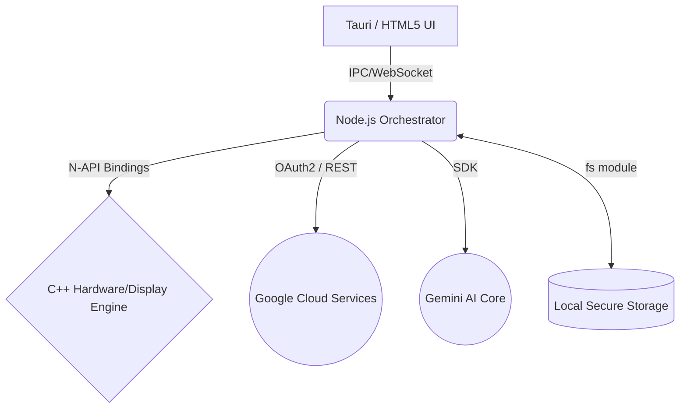

# VidyaOS Node.js Architecture Blueprint

## 1. Overview
The Node.js Orchestrator Daemon sits between the **Low-Level C++ UI/Hardware Engine** and the **Cloud/Web Layer**. It replaces complex C++ networking and async task handling with native, high-performance Node.js asynchronous event loops.

## 2. Component Layout

### A. C++ Native Addons (N-API)
We use `node-addon-api` to compile C++ functions directly into `.node` binaries that Node.js can execute with **zero overhead**. 
- **Role:** Handles display resolution switching, memory telemetry polling, and raw SDL2 window hooks.
- **Example:** A `setResolution(width, height)` C++ function is exposed natively to JS, allowing the UI to instantly trigger hardware changes without shell processes.

### B. Node.js Daemon (index.js)
The orchestrator. It executes on OS startup.
- **Role:** Loads the C++ bindings via `require('./build/Release/resolution.node')`.
- Listens to IPC messages or WebSocket events from the Tauri/Electron UI layer.

### C. The Gemini AI Core (services/gemini.js)
- **Role:** Uses the `@google/generative-ai` library.
- Fetches real-time context from the C++ telemetry daemon and feeds it into the LLM. 
- Allows the UI to surface intelligent Assistant popups ("Your RAM is at 90%, should I close background processes?").

### D. Google Auth & File Sync (services/settings.js & auth)
- **Role:** Uses `googleapis` to trigger a local OAuth2 web-server flow.
- A temporary Express.js server spins up at `http://localhost:3000/callback` to catch the Google Auth token.
- Securely stores the `refresh_token` in a local JSON config managed by the native `fs` module.
- Mounts Google Drive files conceptually inside the UI's File Manager.

## 3. Workflow Example: Changing Resolution
1. User clicks "1080p" in the Tauri UI Settings panel.
2. UI sends `SET_RES: 1920x1080` to the Node.js daemon.
3. Node.js reads the request, updates the local `settings.json` file.
4. Node.js immediately calls `resolutionAddon.setResolution(1920, 1080)`.
5. The C++ hardware engine intercepts the N-API call and executes native display scaling APIs.
